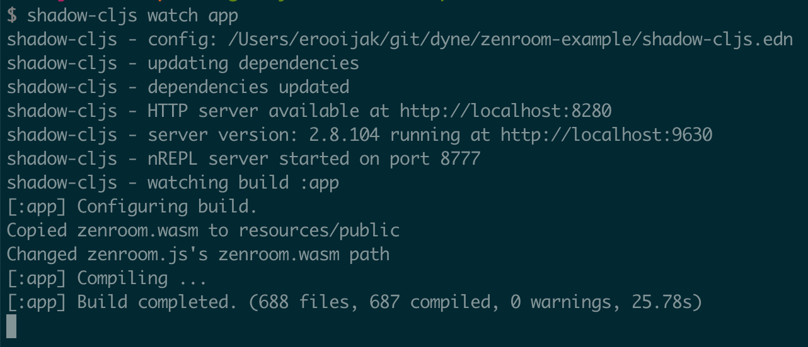
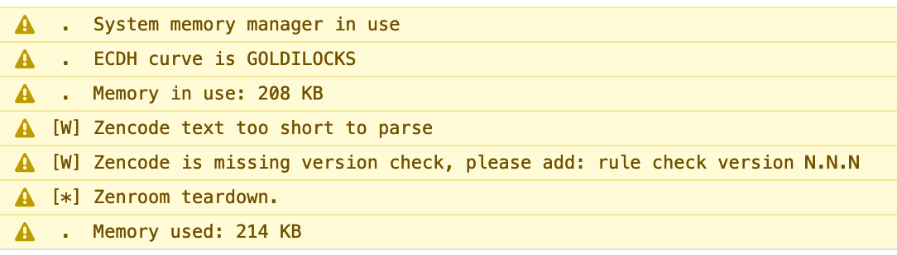

# Make ❤ with Zenroom in ClojureScript

This article is part of a series of blog posts about interacting with Zenroom inside the JavaScript world. This is an entry showing how to use Zenroom from ClojureScript.

1. [Part one Zenroom in node.js](https://www.dyne.org/using-zenroom-with-javascript-nodejs-part1/)
1. [Part two Zenroom in the browser](https://www.dyne.org/using-zenroom-with-javascript-browser-part2/)
1. [Part three Zenroom in React](https://www.dyne.org/using-zenroom-with-javascript-react-part3/)
1. Part four Zenroom in commonjs and ES6
1. [Part five Zenroom in ClojureScript](https://www.dyne.org/using-zenroom-with-clojurescript-part5/)

And also note this [React Zenroom example application](https://github.com/dyne/zenroom-react).

---

If you came here because of ClojureScript, let's first introduce Zenroom.

## ☯ Zenroom

[Zenroom](https://zenroom.org) is inspired by [technological sovereignty](https://youtu.be/RvBRbwBm_nQ) and [Data Commons](https://decodeproject.eu/data-commons-city) (_"How can we ensure that it’s us, the citizens, and not big tech-companies, who decide how our data is collected, stored and used?"_). Zenroom's goals are to improve awareness of how data is processed and to make it easier for developers to create applications that follow [privacy by design strategies](https://decodeproject.eu/publications/privacy-design-strategies-decode-architecture).

Zenroom is a small Virtual Machine that can run end-to-end encryption on multiple platforms embedded in any language and blockchain without external dependencies and without access to IO or networking. It executes [cryptographic operations](https://zenroom.org/#features) and smart contracts. These operations are described in the programming language Lua or in Zenroom's own domain specific language called Zencode (inspired by [langsec](http://langsec.org/) and Gherkin's Given-When-Then syntax).

>The Zencode language makes it easy and less error-prone to write portable scripts implementing end-to-end encryption with operations executed inside an isolated environment (the Zenroom VM) that can be easily ported to any platform, embedded in any language and made inter-operable with any blockchain. -- [Zenroom Whitepaper](https://files.dyne.org/zenroom/Zenroom_Whitepaper.pdf)

Zenroom is mostly written in C but transpiled to WebAssembly using the [emscripten](https://emscripten.org/) toolchain. This makes it possible for Zenroom to reach Node and the browser. Via the [Zenroom Javascript bindings](https://github.com/DECODEproject/Zenroom/tree/master/bindings/javascript) Zenroom can be used conveniently from JavaScript and thus ClojureScript. 

When we look at the example ClojureScript application we'll learn more about Zenroom.

Now, if you came here for Zenroom and JavaScript, let's introduce ClojureScript.

## () ClojureScript
[ClojureScript](https://clojurescript.org/) is a compiler for [Clojure](https://clojure.org/) that targets JavaScript.


ClojureScript consists of immutable data structures and pure functions, primitives to encapsulate state, interoperability with the host (JavaScript) and data-driven DSLs via macros. When ClojureScript is combined with React we access [a pure Clojure world where the view is a function of application state](https://medium.com/@jacekschae/learn-how-to-build-functional-front-ends-with-clojurescript-and-react-733fa260dd6b).

In this demo we'll use [Reagent](https://reagent-project.github.io/), a minimalistic interface between ClojureScript and React. And [shadow-cljs](https://shadow-cljs.org/) as the build tool that integrates with `npm` and supports hot code reloading.

For demo purposes let's try to recreate the [Zenroom in-browser demo](https://dev.zenroom.org/demo/) (a demo website where any Zencode can be evaluated) site using ClojureScript. Because if you can evaluate Zencode using the Zenroom VM, you can do anything.

## ⌨ Let's go

In the demo we assume you have [`node`](https://nodejs.org/), [`npm`](https://nodejs.org/) or [`yarn`](https://www.yarnpkg.com/) and Java installed (shadow-cljs does not use self-hosted ClojureScript)

### 💻 Install necessary npm packages

Now, let's create a folder for the project, a folder for `resources`, a `src` folder for Clojure and ClojureScript files, and initialize a `package.json` file for managing npm packages:

```sh
mkdir zenroom-example
cd zenroom-example
mkdir -p src resources/public

# npm
npm init

# yarn
yarn init
```

Then install shadow-cljs using `npm` or `yarn`:

```sh
# npm
npm install -g shadow-cljs --save-dev

# yarn
yarn global add shadow-cljs --dev
```

This also creates an entry in `package.json` for shadow-cljs as a dev dependency, which is necessary for development.

Then install the React dependencies Reagent will need later:

```sh
# npm
npm install react@16.13.0 react-dom@16.13.0 create-react-class

# yarn
yarn add react@16.13.0 react-dom@16.13.0 create-react-class
```

And now let's also add Zenroom and [the dependencies used by Zenroom](https://github.com/DECODEproject/Zenroom/blob/master/bindings/javascript/package.json#L49) so that shadow-cljs works without complaints:

```sh
# npm
npm install zenroom core-js@3.1.4 regenerator-runtime

# yarn
yarn add zenroom core-js@3.14 regenerator-runtime
```

Your `package.json` file now looks something like this:

```javascript
{
  "name": "zenroom-example",
  "private": true,
  "devDependencies": {
    "shadow-cljs": "2.8.109"
  },
  "dependencies": {
    "core-js": "^3.1.4",
    "create-react-class": "^15.6.3",
    "react": "^16.13.0",
    "react-dom": "^16.13.0",
    "regenerator-runtime": "^0.13.5",
    "zenroom": "^1.1.0"
  }
}
```

We're ready with the JavaScript dependencies. Let's setup our shadow-cljs project configuration.

### 💻 Setting up shadow-cljs

Create a `shadow-cljs.edn` file in the root containing the project configuration:

```clojure
{:nrepl {:port 8777}
 :source-paths ["src"]
 :dependencies [[binaryage/devtools "1.0.0"]
                [reagent "1.0.0-alpha1"]]
 :builds {:app {:target :browser
                :build-hooks [(build/setup-zenroom-wasm-hook)]
                :output-dir "resources/public/js/compiled"
                :asset-path "/js/compiled"
                :modules {:app {:init-fn view/init
                                :preloads [devtools.preload]}}
                :devtools {:http-root "resources/public"
                           :http-port 8280}}}}
```

We specify the source paths, an nREPL port for connecting to the running application from an editor, build configuration including hot code reloading using devtools, and a dependency on Reagent. We see a reference to `view/init`. And there's also a `build/setup-zenroom-wasm-hook` build hook to automate some necessary step to work with Zenroom. Let's look into the latter first.

### ✍ Build hook for making the Zenroom npm package browser ready

In ClojureScript with Reagent we come across the same hurdles with `npm` and `wasm` as described in [Part three Zenroom in React](https://www.dyne.org/using-zenroom-with-javascript-react-part3/):

1. We need to make `zenroom.wasm` from the npm package available on the server (in our case by copying it into `resources/public`).
1. We need to remove the line from `zenroom.js` that tries to locate `zenroom.wasm` locally.

To easen this process a [shadow-cljs build hook](https://shadow-cljs.github.io/docs/UsersGuide.html#build-hooks) can be created that executes exactly these steps. Create a build file in `src/build.clj` that performs these steps:

```clojure
(ns build
  (:require
   [clojure.java.shell :refer [sh]]))

(defn- copy-wasm-to-public []
  (sh "cp" "node_modules/zenroom/dist/lib/zenroom.wasm" "resources/public/"))

(defn- remove-locate-wasm-locally-line []
  (sh "sed" "-i.bak" "/wasmBinaryFile = locateFile/d" "node_modules/zenroom/dist/lib/zenroom.js"))

(defn setup-zenroom-wasm-hook
  {:shadow.build/stage :configure}
  [build-state]
  (copy-wasm-to-public)
  (remove-locate-wasm-locally-line)
  build-state)
```

Using shell commands, on every build the `zenroom.wasm` file is moved from the Zenroom npm package's node_modules folder to `resources/public`, where it will be served during development and packaged for a production build. And from the `zenroom.js` file the line that works on Node.js (which has access to the file system, where the browser does not) is removed so the file is located from the root of the server.

We emitted error handling above, but if you add some log lines based on the success or failure of the commands (as in [the final example app](https://github.com/transducer/zenroom-example/blob/master/src/clj/build.clj)), the build steps are visible when running the app later on:



Next we'll look at the view and its Reagent components.

## ⚛ The view

We want to create a simple website where we can pass Zencode to the Zenroom VM and get the results. 

First ensure we have an `index.html` page, create one in `resources/public` with the following content:

```html
<!doctype html>
<html lang="en">
  <head>
    <meta charset='utf-8'>
    <link rel="stylesheet" href="https://cdn.jsdelivr.net/npm/bulma@0.8.2/css/bulma.min.css">
  </head>
  <body>
    <div id="app"></div>
    <script src="js/compiled/app.js"></script>
    <script>view.init();</script>
  </body>
</html>
```

We add [Bulma](https://bulma.io/) for CSS styling. And the body contains the regular setup for including and initializing the compiled ClojureScript code.

Let's create a file `cljs/zenroom_example/view.cljs`. On the top add a namespace declaration with the following dependencies:

```clojure
(ns view
  (:require
   [cljs.reader :refer [read-string]]
   [clojure.string :as string]
   [reagent.core :as r]
   [reagent.dom :as dom]
   [zenroom]))
```

We add Reagent, `read-string` for parsing string input, and we include the Zenroom `npm` package by requiring `[zenroom]`. 

The Zenroom module is required now and has options available which we'll set later. Let's first create a [Reagent atom](https://reagent-project.github.io/) called `app-state`. A Reagent atom ensures that any component that dereferences the atom is automatically rerendered when its value changes. To avoid reloading the `app-state` when the file changes, `app-state` is defined only when the var has no root value using `defonce`. `app-state` will hold the application state (containing the options available on the [Zenroom module](https://github.com/DECODEproject/Zenroom/tree/master/bindings/javascript)):

```clojure
(defonce app-state
  (r/atom
   {:input ""
    :keys ""
    :data ""
    :success? false
    :results []}))
```

Besides Zencode input, the Zenroom VM also takes KEYS and DATA as JSON input. Zencode will have access to the KEYS and DATA:

>Zencode will find anything in KEYS and DATA just the same. The difference is that Zenroom may use underlying OS techniques to protect KEYS from being accessed by external processes and in general doesn't forces the host developer to join public with private data exposing it to further risks. [https://github.com/DECODEproject/Zenroom/issues/95]

`:success` will indicate if compilation of the provided `:input` was successful or not, and `:results` will contain the printed output of the Zencode script.

Now we can write a function `evaluate!` that will evaluate the Zencode put into our demo enviroment. Using `doto` we use method chaining to set all the values. Another way would be to pass a JavaScript options object containing the same keys and values.

```clojure
(defn evaluate! []
  (doto zenroom
    (.script (:input @app-state))
    (.keys (-> @app-state :keys read-string clj->js))
    (.data (-> @app-state :data read-string clj->js))
    (.print (fn [s] (swap! app-state update :results conj s)))
    (.success (fn [] (swap! app-state assoc :success? true)))
    (.error (fn [] (swap! app-state assoc :success? false)))
    .zencode-exec))
```

`evaluate!` sets the following options:

- `script` derefs the `app-state` to get the value of the input string (the Zencode contract).
-`keys` and `data` deref the `app-state` and parse it to a JavaScript data structure to add the KEYS and DATA.
- `print` is the function that is called any time Zencode prints something, in this case it will append the output to the value of the`:results` key, a vector that holds the results.
- `success` and `error` update the value for the`:success?` key in `app-state` with success or failure.
- `zencode_exec` is called to evaluate the given Zencode contract. Zencode uses underlying Lua code. See for example the the [zencode_dp3t](https://github.com/DECODEproject/Zenroom/blob/master/src/lua/zencode_dp3t.lua) extension as mentioned in the blogpost [Decentralized Privacy-Preserving Proximity Tracing crypto made easy](https://medium.com/@jaromil/decentralized-privacy-preserving-proximity-tracing-cryptography-made-easy-af0a6ae48640). The simpler Zencode DSL calls Lua code. To execute Lua code instead of using the primitives available in Zencode we can call `zenroom_exec` instead of `zencode_exec` on the Zenroom object.

`evaluate!` is the gist of the interaction with the Zenroom VM, now we have to get the information in and out of the `app-state`.

First let's add a method to clear the results:

```clojure
(defn clear! []
  (swap! db assoc :results []))
```

Now we can add a Bulma column for a Zencode input textarea:

```clojure
(defn zencode-column []
  [:div.column
   [:div.subtitle.is-2 "Zencode"]
   [:textarea.textarea
    {:rows 20
     :on-change (fn [e] (swap! app-state assoc :input (-> e .-target .-value)))}]
   [:button.button {:on-click (fn [] (clear!) (evaluate!))} "Evaluate"]
   [:label.label.is-pulled-right "Compiles? "
    [:input.checkbox
     {:type
      :checkbox
      :checked (:success? @app-state)
      :read-only true}]]])
```

Here we have:
1. A textarea that puts its contents into the `app-state`
1. A button "Evaluate" that clears possible previous results via `clear!` and calls `evaluate!` to evaluate the Zencode using the Zenroom npm module.
1. A checkbox that is checked if the code compiles and vice versa.

For obtaining the keys and data we write code analagous to that for the Zencode input. And we show the results on the page in a textarea that looks like a terminal using a dark background and green letters:

```clojure
(defn keys-data-results-column []
  [:div.column
   [:h2.subtitle.is-2 "Keys"]
   [:textarea.textarea
    {:rows 3
     :on-change (fn [e] (swap! app-state assoc :keys (-> e .-target .-value)))}]
   [:h2.subtitle.is-2 "Data"]
   [:textarea.textarea
    {:rows 3
     :on-change (fn [e] (swap! app-state assoc :data (-> e .-target .-value)))}]
   [:h2.subtitle.is-2 "Output"]
   [:textarea.textarea.has-background-dark.has-text-success
    {:rows 10 :value (string/join "\n" (:results @app-state)) :read-only true}]])

```

Note that KEYS and DATA have to be added as [EDN data structures](https://github.com/edn-format/edn), and not JSON (so strip off the `:`s).

Finally, we create an embedding panel and load that onto the page using Reagent's `render` function.

```clojure
(defn panel []
  [:div.container
   [:h1.title.is-1 "Zenroom Demo"]
   [:div.columns
    [zencode-column]
    [keys-data-results-column]]])

(defn ^:export ^:dev/after-load init []
  (dom/render [panel] (.getElementById js/document "app")))
```

In `init`, the `:export` metadata ensures that `init()` is available in JavaScript. `^:dev/after-load` tells the shadow-cljs compiler to call the function after load when live reloading.

The `init` function is referred to in `shadow-cljs.edn` and also `resources/public/index.html` and is the entry point for the application. It starts the application and inserts the Reagent components into the div with the id "app" (available in `resources/public/index.html`).

That's it.

Your final project structure should look like this:

```sh
$ tree
.
├── package.json
├── resources
│   └── public
│       └── index.html
├── shadow-cljs.edn
└── src
    ├── build.clj
    └── view.cljs
```

Now let's run it.

## ⌚ Running the application

To run the app with hot code reloading (when a file changes it is compiled and loaded into the browser without changing application state) use

```sh
shadow-cljs watch app
```

This command can also be run from inside an editor with shadow-cljs support so that we can connect a REPL to the running application. This can be done with for example [Emacs with CIDER](https://cider.mx/), [Visual Studio Code with Calva](https://github.com/BetterThanTomorrow/calva/blob/master/docs/readthedocs/source/jack-in-guide.md), [IntelliJ or Eclipse with Cursive](https://cursive-ide.com/) or [Vim with Fireplace](https://github.com/tpope/vim-fireplace).

After we have started watching the app we can visit [http://localhost:8280/](http://localhost:8280/). Here we see our own ClojureScript Zenroom demo environment. 

Let's follow the steps from [Decentralized Privacy-Preserving Proximity Tracing crypto made easy](https://medium.com/@jaromil/decentralized-privacy-preserving-proximity-tracing-cryptography-made-easy-af0a6ae48640):

1. Setup a secret day key (SK)
1. Create a list of Ephemeral IDs (EphIDs)
1. Check the proximity to "infected" devices

in the running app:


The Zencode and input data is retrieved, passed to the Zenroom VM, and the result of evaluation is displayed...

Phew, we have not been near an infected device. 

Note that the example above is better suited for a portable device that also has access to promimity information via for example Bluetooth.
And note that we could be connected with a central database or [distributed ledger](https://zenroom.org/zenbridge/) to pick up the information on infected devices and also broadcast our own if we get infected. 

Anyhow, if we would look in the console we see stdout and stderr messages coming out of the WebAssembly:



It is possibly to pick this up in the application and show it in an output window by overwriting the [print methods on the `Module` object](https://emscripten.org/docs/api_reference/module.html) as is done in the [Zenroom demo](https://dev.zenroom.org/demo/), but I did not succeed in doing this from ClojureScript.

Now that we have a running application we can create a production build and deploy our website with the embedded Zenroom VM.

## 🔥 Production build

To create a minified release build (a single `app.js`) that has stripped out all development related code and has run the code through the [Google Closure Compiler](https://developers.google.com/closure/compiler) use `shadow-cljs release app`. Compiled frontend code will be available in `resources/public` and can be deployed as a static website using your webserver of choice.

## ☕ Conclusion

With the right configuration we can run Zenroom from ClojureScript tooling thanks to the Zenroom npm package with JavaScript bindings.

The source code of the full example is available at [https://www.github.com/transducer/zenroom-cljs-demo](https://www.github.com/transducer/zenroom-cljs-demo).
